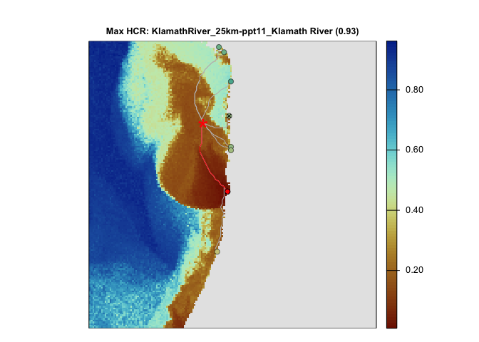
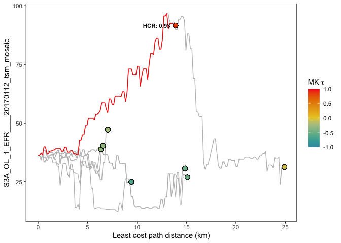
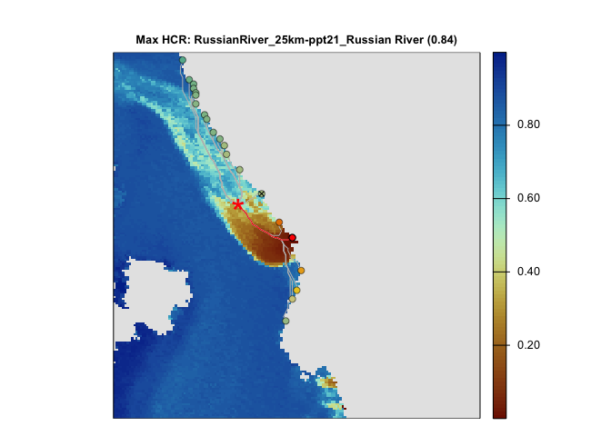
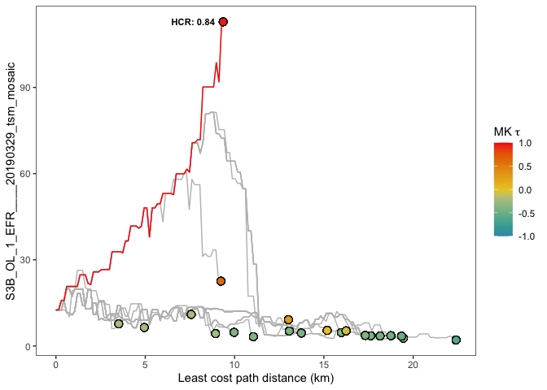
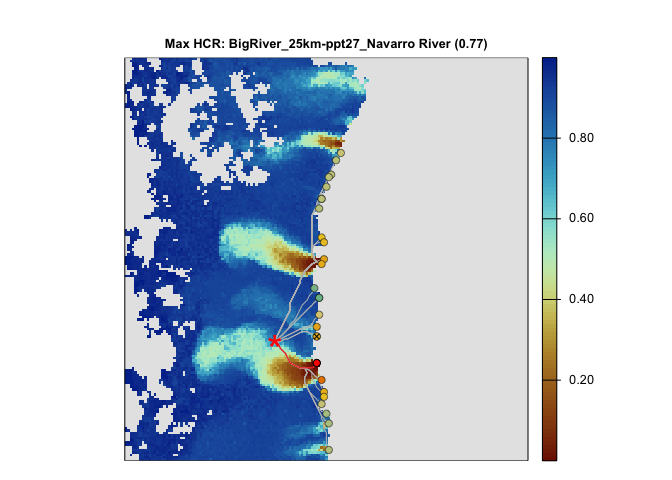
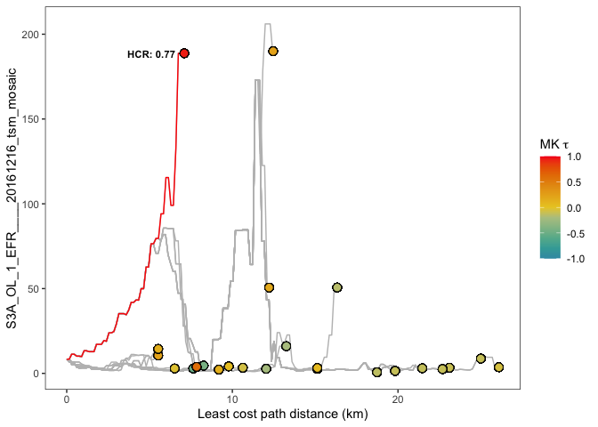

<!-- README.md is generated from README.Rmd. Please edit that file -->

# HCR

<!-- badges: start -->
<!-- badges: end -->

Code for implementing Hydrologic Connectivity to Rivers.

## Installation

You can install the development version of HCR from
[GitHub](https://github.com/) with:

``` r
# install.packages("pak")
pak::pak("khondula/HCR")
```

## Example

This is a basic example to calculate HCR. Three examples of input
datasets are included

``` r
library(HCR)
klamath_img_path <- system.file("extdata", "2017-01-12_S3A_tsm-Klamath.tif", package = "HCR")
klamath_sea_path <- system.file("extdata", "sea_pt-Klamath.geojson", package = "HCR")
klamath_land_path <- system.file("extdata", "river_pts-Klamath.geojson", package = "HCR")

klamath_out <- run_hcr(input_tif = klamath_img_path,
        sea_point = klamath_sea_path,
        land_points = klamath_land_path,
        land_points_id_col = 'pourpoint_id',
        output_dir = 'klamath_out')
#> EXP_SCALE_PAR is set as 10
#> reading in input tif: /Library/Frameworks/R.framework/Versions/4.3-x86_64/Resources/library/HCR/extdata/2017-01-12_S3A_tsm-Klamath.tif as img_id: 2017-01-12_S3A_tsm-Klamath
#> ...preparing raster to make cost surface
#> ...extracting values from least cost paths
#> ...testing paths for mann kendall
#> connected path to KlamathRiver_25km-ppt11_Klamath River (tau: 0.86)
#> .....now saving results in /Users/khondula/Documents/software/HCR/HCRout_klamath_out_2017-01-12_S3A_tsm-Klamath_20260614160642
```



    #> img_id: 2017-01-12_S3A_tsm-Klamath
    #> Max HCR point: KlamathRiver_25km-ppt11_Klamath River (0.927)
    #> Closest point: KlamathRiver_25km-ppt4_Damnation Creek

    russian_img_path <- system.file("extdata", "2019-03-29_S3B_tsm-Russian.tif", package = "HCR")
    russian_sea_path <- system.file("extdata", "sea_pt-Russian.geojson", package = "HCR")
    russian_land_path <- system.file("extdata", "river_pts-Russian.geojson", package = "HCR")

    russian_out <- run_hcr(input_tif = russian_img_path,
            sea_point = russian_sea_path,
            land_points = russian_land_path,
            land_points_id_col = 'pourpoint_id',
            output_dir = 'russian_out')
    #> EXP_SCALE_PAR is set as 10
    #> reading in input tif: /Library/Frameworks/R.framework/Versions/4.3-x86_64/Resources/library/HCR/extdata/2019-03-29_S3B_tsm-Russian.tif as img_id: 2019-03-29_S3B_tsm-Russian
    #> ...preparing raster to make cost surface
    #> ...extracting values from least cost paths
    #> ...testing paths for mann kendall
    #> connected path to RussianRiver_25km-ppt21_Russian River (tau: 0.96)
    #> .....now saving results in /Users/khondula/Documents/software/HCR/HCRout_russian_out_2019-03-29_S3B_tsm-Russian_20260614160645



    #> img_id: 2019-03-29_S3B_tsm-Russian
    #> Max HCR point: RussianRiver_25km-ppt21_Russian River (0.841)
    #> Closest point: RussianRiver_25km-ppt15_NA

    navarro_img_path <- system.file("extdata", "2016-12-16_S3A_tsm-Navarro.tif", package = "HCR")
    navarro_sea_path <- system.file("extdata", "sea_pt-Navarro.geojson", package = "HCR")
    navarro_land_path <- system.file("extdata", "river_pts-Navarro.geojson", package = "HCR")

    navarro_out <- run_hcr(input_tif = navarro_img_path,
            sea_point = navarro_sea_path,
            land_points = navarro_land_path,
            land_points_id_col = 'pourpoint_id',
            output_dir = 'russian_out')
    #> EXP_SCALE_PAR is set as 10
    #> reading in input tif: /Library/Frameworks/R.framework/Versions/4.3-x86_64/Resources/library/HCR/extdata/2016-12-16_S3A_tsm-Navarro.tif as img_id: 2016-12-16_S3A_tsm-Navarro
    #> ...preparing raster to make cost surface
    #> ...extracting values from least cost paths
    #> ...testing paths for mann kendall
    #> connected path to BigRiver_25km-ppt27_Navarro River (tau: 0.95)
    #> .....now saving results in /Users/khondula/Documents/software/HCR/HCRout_russian_out_2016-12-16_S3A_tsm-Navarro_20260614160649



    #> img_id: 2016-12-16_S3A_tsm-Navarro
    #> Max HCR point: BigRiver_25km-ppt27_Navarro River (0.766)
    #> Closest point: BigRiver_25km-ppt18_Little Salmon Creek
